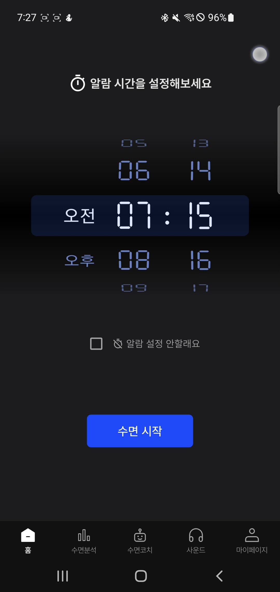
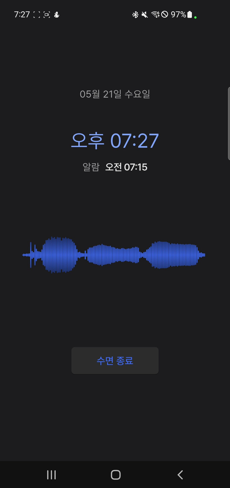
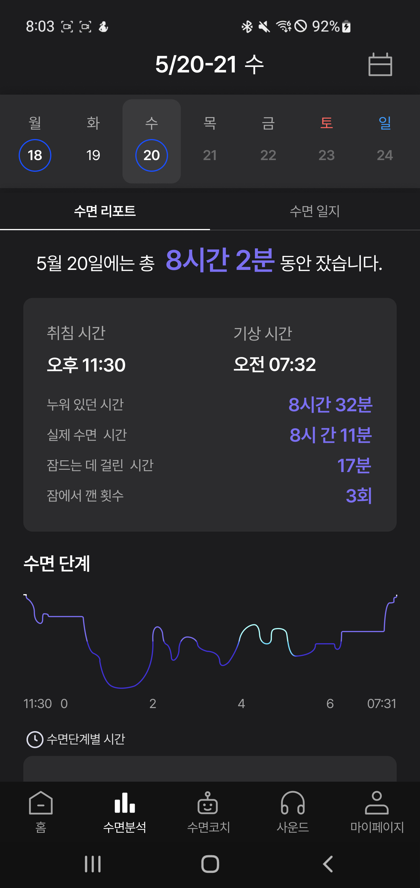

# SleepTight

[](https://flutter.dev)
[](https://dart.dev)
[](https://riverpod.dev)
[](https://developer.android.com/wear)

AI 기반 수면 사운드 분석과 RAG 코칭을 제공하는 통합 수면 관리 애플리케이션

## 목차

1. [프로젝트 소개](#1-프로젝트-소개)
2. [데모](#2-데모)
3. [기술 스택](#3-기술-스택)
4. [시스템 아키텍처](#4-시스템-아키텍처)
5. [주요 기능](#5-주요-기능)
6. [프로젝트 구조](#6-프로젝트-구조)
7. [아키텍처 & 상태 관리](#7-아키텍처--상태-관리)
8. [설치 및 실행](#8-설치-및-실행)
9. [개발 가이드](#9-개발-가이드)

---

## 1. 프로젝트 소개

SleepTight는 수면 중 발생하는 소리(코골이, 이갈이 등)를 딥러닝 모델로 분석하고, RAG 기반 AI 코칭을 통해 개인화된 수면 개선 가이드를 제공하는 크로스 플랫폼 수면 관리 앱입니다.

Flutter로 제작된 Android/iOS 앱과 Kotlin 기반 Wear OS 앱으로 구성되며, NestJS API 서버 및 FastAPI 기반 AI 서비스와 연동합니다.

**핵심 가치**
- 수면 중 소리를 실시간으로 분석해 코골이·이갈이·수면 무호흡을 감지
- Wear OS 연동으로 심박수·활동량 데이터를 함께 수집
- RAG 기반 LLM이 사용자 데이터를 바탕으로 맞춤형 수면 코칭 제공

---

## 2. 데모

<p align="center">
  
  
  
  
</p>
<p align="center">
  홈 &nbsp;&nbsp;&nbsp;&nbsp;&nbsp;&nbsp;&nbsp;&nbsp;&nbsp;&nbsp; 수면 모드 &nbsp;&nbsp;&nbsp;&nbsp;&nbsp;&nbsp;&nbsp;&nbsp; 수면 분석 &nbsp;&nbsp;&nbsp;&nbsp;&nbsp;&nbsp;&nbsp;&nbsp; AI 코칭
</p>

---

## 3. 기술 스택

### Flutter 모바일 앱

| 카테고리 | 기술 | 버전 |
|---|---|---|
| 프레임워크 | Flutter | 3.7.2 |
| 상태 관리 | flutter_riverpod + riverpod_annotation | 2.6.1 |
| 라우팅 | go_router | 15.1.1 |
| 네트워크 | dio | 5.8.0 |
| 오디오 녹음 | flutter_sound | 9.28.0 |
| 오디오 재생 | just_audio + audio_waveforms | 0.9.46 |
| 오디오 처리 | ffmpeg_kit_flutter_new | 1.5.0 |
| 건강 데이터 | health (Google Fit / HealthKit) | 12.2.0 |
| 차트 & 캘린더 | fl_chart + table_calendar + sleep_chart | 1.0.0 |
| 소셜 로그인 | kakao_flutter_sdk_user | 1.9.7 |
| 푸시 알림 | firebase_messaging | 15.2.6 |
| 보안 저장소 | flutter_secure_storage | 9.2.4 |
| 로컬 저장소 | shared_preferences | 2.5.3 |

### Wear OS 앱

| 기술 | 설명 |
|---|---|
| Kotlin + Jetpack Compose | Wear OS UI 개발 |
| Wearable Data Layer API | 스마트폰 ↔ 워치 양방향 통신 |
| Health Services | 심박수 · 걸음 수 수집 |

### 백엔드 / 인프라 (별도 팀 담당)

NestJS (API) · FastAPI (AI 코칭, 사운드 분석) · PostgreSQL · Redis · RabbitMQ · Docker · AWS S3 · Pinecone

---

## 4. 시스템 아키텍처

```
[Flutter App]  ──── REST API ───▶  [NestJS API Server]
     │                                      │
     │                               [RabbitMQ]
     │                                      │
[Wear OS App]  ── Wearable Data Layer ─▶    ▼
                                    [Sound AI Service]
                                    (FastAPI + PyTorch)
```

---

## 5. 주요 기능

### 수면 모드
- 수면 시작/종료 기록 및 알람 설정
- 수면 중 주기적 오디오 녹음 (청크 단위 업로드)
- 백그라운드에서도 지속적인 녹음 유지

### 수면 분석
- 수면 단계(깊은 수면·얕은 수면·REM) 시각화
- 수면 품질 점수 및 주간/월간 리포트
- 달력 뷰로 날짜별 수면 기록 조회

### 수면 사운드 분석
- AI 기반 코골이·이갈이·수면 무호흡 감지
- 감지된 이벤트 구간 클립 재생 및 파형 표시
- 이벤트 유형별 발생 횟수 통계

### AI 수면 코칭
- 사용자 수면 패턴 기반 RAG 코칭
- 코칭 기록 저장 및 히스토리 조회

### Wear OS 연동
- 걸음 수·소모 칼로리·심박수 실시간 수집
- 스마트폰 ↔ 워치 양방향 데이터 동기화

### 부가 기능
- 카테고리별 수면 유도 음악 스트리밍 (미니 플레이어 / 전체 화면 플레이어)
- 수면 일기 작성
- 카카오 소셜 로그인
- FCM 푸시 알림

---

## 6. 프로젝트 구조

```
SleepTight/
├── client/
│   ├── app/          # Flutter 모바일 앱
│   └── wear/         # Wear OS 앱 (Kotlin)
│
├── server/
│   ├── api/          # NestJS 백엔드 API
│   ├── ai/           # AI 코칭 서비스 (FastAPI)
│   └── sound-ai/     # 사운드 분석 서비스 (FastAPI + PyTorch)
│
└── cicd/             # Docker Compose, Jenkins, 배포 스크립트
```

### Flutter 앱 구조 (`client/app/lib/`)

Clean Architecture 기반으로 `core`와 `features`를 분리합니다.

```
lib/
├── core/                         # 앱 전역 공통 로직
│   ├── config/
│   │   ├── router.dart           # Go Router (인증 상태 기반 리다이렉트)
│   │   └── theme/                # 컬러, 텍스트 스타일, 테마 설정
│   ├── network/
│   │   ├── dio_client.dart       # HTTP 클라이언트
│   │   └── api_interceptor.dart  # 토큰 자동 갱신 인터셉터
│   ├── service/
│   │   ├── fcm_messaging_service.dart
│   │   └── alarm_service.dart
│   └── storage/
│       ├── secure_storage_provider.dart    # JWT 토큰 보안 저장
│       └── shared_preferences_provider.dart
│
├── features/                     # 기능별 모듈
│   ├── auth/                     # 카카오 로그인 · 토큰 관리
│   ├── sleep_mode/               # 수면 기록 · 알람 · 오디오 녹음 (핵심)
│   ├── analysis/                 # 수면 리포트 · 다이어리 · 차트
│   ├── coach/                    # AI 수면 코칭
│   ├── music/                    # 음악 스트리밍 · 플레이어
│   ├── health/                   # 건강 데이터 · Wear OS 통신
│   └── user/                     # 프로필 · 설정 (20개+ 서브 화면)
│
├── shared/
│   └── widgets/                  # 공용 위젯 (버튼, 텍스트필드, 바텀 내비 등)
│
└── main.dart
```

각 feature는 `data / domain / presentation` 계층으로 분리됩니다.

```
features/sleep_mode/
├── data/
│   ├── datasources/              # 원격 · 로컬 데이터 소스
│   ├── models/                   # DTO (Request / Response)
│   ├── repositories/             # Repository 구현체
│   └── services/                 # 오디오 녹음, 수면 단계 판정 등
├── domain/
│   └── repositories/             # Repository 인터페이스
└── presentation/
    ├── providers/                # Riverpod Provider
    ├── screens/                  # 화면 위젯
    └── widgets/                  # UI 컴포넌트
```

### Wear OS 앱 구조 (`client/wear/`)

```
app/src/main/java/com/example/sleeptight/wear/
├── data/
│   ├── model/           # HealthData 모델
│   ├── repository/      # WearableRepository
│   └── service/         # WearableMessageService (Data Layer API)
└── presentation/
    ├── MainActivity.kt
    ├── viewmodel/        # HealthViewModel
    └── components/       # MainScreen, MetricPage, CircularProgressBar
```

---

## 7. 아키텍처 & 상태 관리

### Clean Architecture

```
Presentation  ──▶  Domain  ──▶  Data
 (Provider)      (Repository    (DataSource
 (Screen)         Interface)     구현체)
 (Widget)        (Entity)       (DTO · Model)
```

- **Domain** 계층은 Flutter · 외부 라이브러리에 의존하지 않는 순수 Dart 코드
- **Data** 계층이 Repository 인터페이스를 구현하므로 데이터 소스 교체 시 Presentation·Domain은 변경 불필요

### Riverpod 상태 관리

`@riverpod` 애노테이션 기반 코드 생성 방식을 사용합니다.

```dart
// 예시: 알람 상태 Provider
@riverpod
class AlarmNotifier extends _$AlarmNotifier {
  @override
  AlarmState build() => AlarmState.initial();

  Future<void> setAlarm(DateTime time) async { ... }
}
```

코드 생성 명령어:

```bash
flutter pub run build_runner build             # 1회 생성
flutter pub run build_runner watch             # 파일 변경 감지 모드
```

### Go Router – 인증 상태 기반 리다이렉트

`AuthStatus`에 따라 접근 가능한 라우트가 자동으로 결정됩니다.

| AuthStatus | 리다이렉트 |
|---|---|
| `guest` | `/welcome` (로그인 화면) |
| `incompleteRegistration` | `/signup` (추가 정보 입력) |
| `active` | 전체 앱 접근 허용 |
| `pendingWithdraw` | `/say-goodbye` |

**주요 라우트:**

```
/welcome · /signup           # 인증
/home                        # 수면 시작
/home/sleeping               # 수면 모드
/sleep-analysis              # 리포트 · 다이어리 탭
/sleep-coach                 # AI 코칭
/sound                       # 음악 플레이어
/mypage/**                   # 프로필 · 설정
```

### 디자인 시스템

- **폰트:** Pretendard (Regular ~ ExtraBold), Seven Segment (시계 표시용)
- **테마:** Material 3 다크 테마
- **컬러:** Primary `#1A4FFF` · Background `#121212` · Gray00–07 팔레트
- **텍스트 스케일:** T1–T3 (Title) · B1–B5 (Body) · H3 (Headline) · C1/C3 (Caption)

---

## 8. 설치 및 실행

### 사전 요구사항

| 도구 | 버전 |
|---|---|
| Flutter SDK | 3.7.2+ |
| Dart | 3.x |
| Android Studio | Latest |
| Xcode | Latest (iOS 빌드 시) |

### Flutter 앱

```bash
cd client/app

# 의존성 설치
flutter pub get

# Riverpod 코드 생성
flutter pub run build_runner build --delete-conflicting-outputs

# 환경 변수 설정
cp .env.example .env

# 실행
flutter run
```

**Makefile 명령어**

| 명령어 | 설명 |
|---|---|
| `make run` | 디바이스에서 앱 실행 |
| `make apk-build` | 릴리스 APK 빌드 (ABI별 분할) |
| `make apk-install` | APK 설치 |
| `make splash` | 스플래시 화면 생성 |
| `make icon` | 앱 아이콘 생성 |
| `make clean` | 빌드 캐시 정리 |

**환경 변수 (`client/app/.env`)**

```env
API_BASE_URL=https://api.sleeptight.com
KAKAO_NATIVE_APP_KEY=your_kakao_app_key
```

### Wear OS 앱

```bash
cd client/wear

./gradlew build
./gradlew installDebug    # 연결된 Wear OS 기기에 설치
```

### 인프라 (백엔드 팀 담당)

```bash
cd cicd
docker-compose -f docker-compose-infra.yml up -d   # PostgreSQL, Redis, RabbitMQ
docker-compose -f docker-compose.yml up -d          # API 서버, AI 서비스
```

---

## 9. 개발 가이드

### 코딩 컨벤션

- Clean Architecture 계층 분리 준수
- Riverpod `@riverpod` 코드 생성 방식 사용
- 네이밍: `snake_case` (파일) · `camelCase` (변수/함수) · `PascalCase` (클래스)
- 공용 UI는 `shared/widgets/`에 추출

### Git 브랜치 전략

```
master
  └── dev/fe       # Frontend 개발 브랜치
  └── dev/be       # Backend 개발 브랜치
  └── dev/ai       # AI 서비스 개발 브랜치
  └── feature/*    # 기능 단위 개발
  └── hotfix/*     # 긴급 수정
```

### 커밋 메시지 규칙

```
feat:      새로운 기능 추가
fix:       버그 수정
docs:      문서 수정
style:     코드 포맷팅 (기능 변경 없음)
refactor:  코드 리팩토링
test:      테스트 코드
chore:     빌드, 설정 변경
```

### 트러블슈팅

**Riverpod 코드 생성 오류**

```bash
flutter clean
flutter pub get
flutter pub run build_runner build --delete-conflicting-outputs
```

**수면 사운드 분석이 PENDING에서 멈출 때**
1. RabbitMQ 연결 상태 확인
2. Sound Analysis 서비스 로그 확인
3. S3 파일 접근 권한 확인

---

*SleepTight — Better Sleep, Better Life*
